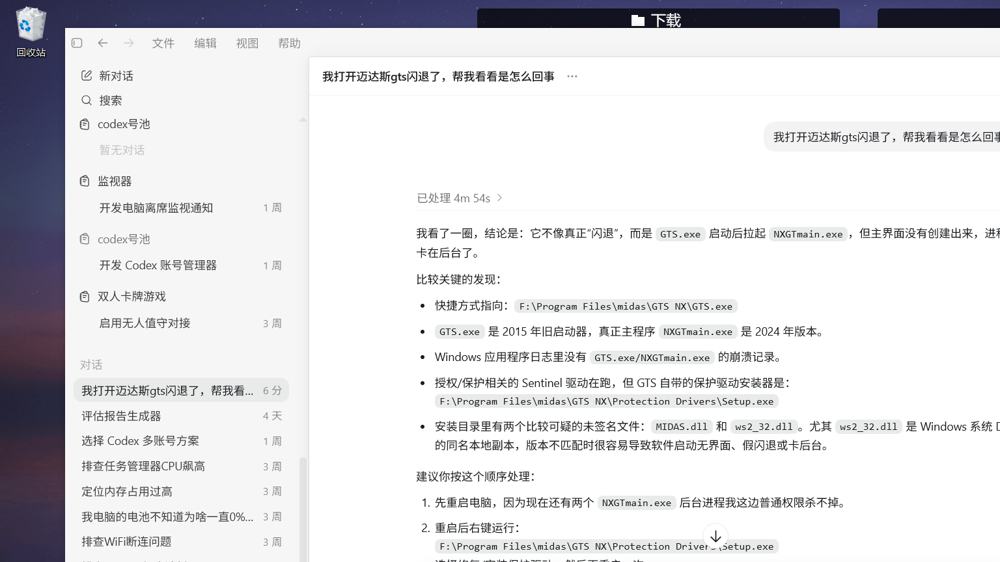

# MiniFences

MiniFences 是一款适用于 Windows 10/11 的桌面 Fence 管理器。它可以将个人桌面和公共桌面中的图标按分区、页面和标签组显示，同时保留文件原本所在的位置。



## 下载与运行

请从 GitHub Releases 下载适合自己的压缩包：

- `MiniFences-win-x64-<版本号>.zip`：推荐版本，自带 .NET 运行库；解压后运行 `MiniFences.exe`，无需另外安装 .NET。
- `MiniFences-win-x64-<版本号>-slim.zip`：轻量版本；需要提前安装对应版本的 Microsoft .NET Desktop Runtime。

首次运行未签名版本时，Windows SmartScreen 可能显示“未知发布者”提示。请只从本项目的 GitHub Releases 下载，并可使用同版本的 `.sha256` 文件核对压缩包。

## 主要功能

- 新建、删除、重命名、锁定、拖动和缩放 Fence。
- 多页桌面、快捷键翻页、页面预览以及跨页移动。
- 标签组合并、排序、拆分及两种标签栏样式。
- 自动网格排列桌面图标，拖动只调整显示顺序。
- 显示、卷起、标签页和 Fence 外观独立设置页面及交互预览。
- 命名布局和自动快照，可恢复页面、位置、归属和图标顺序。
- Windows Shell 原生右键菜单，包括系统和第三方扩展。
- 同时读取个人桌面和公共桌面，同名项目按 Windows 桌面规则合并。

## 文件安全模型

- DesktopGroup 只在配置中记录图标归属，不移动个人桌面或公共桌面的源文件。
- 布局恢复不会创建、移动或删除桌面源文件。
- Folder Portal 显示指定物理目录，其文件操作仍遵循 Windows 的正常文件行为。
- 配置保存在 `%APPDATA%\MiniFences\config.json`。
- 日志保存在 `%APPDATA%\MiniFences\logs\app.log`。

## 从源码构建

需要 Windows 和 .NET 8 SDK：

```powershell
.\.dotnet\dotnet.exe build MiniFences\MiniFences.csproj -c Release
.\.dotnet\dotnet.exe run --project MiniFences.SmokeTests\MiniFences.SmokeTests.csproj -c Release
```

生成自带运行库的推荐包和需要 .NET 的 slim 包：

```powershell
powershell.exe -NoProfile -ExecutionPolicy Bypass -File .\scripts\publish-minifences.ps1
```

也可以只生成其中一种：

```powershell
powershell.exe -NoProfile -ExecutionPolicy Bypass -File .\scripts\publish-minifences.ps1 -Package self-contained
powershell.exe -NoProfile -ExecutionPolicy Bypass -File .\scripts\publish-minifences.ps1 -Package slim
```

发布脚本会自动读取项目版本，并为每个 ZIP 生成 SHA-256 校验文件。
